# MLA Guide by JDZeal [(Click Here For My YouTube Videos!)](https://www.youtube.com/playlist?list=PLrFzIm18kcMUgmMSh7pnsnQDTnR1-W68q)
> # **Game Phases**
> ## **Early Game** - Awakening The Core Three
> 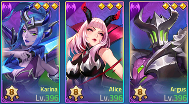
>
> When you start the game you will want to focus on three heroes that are part of the same element so that you can win battles in most of the areas of the game, primarily the ***Campaign Missions*** and ***Tower of Babel***. You'll probably want at least one hero that can absorb a lot of damage (like a tank or fighter) and then two who can clear the enemies. Each element has its strengths and weaknesses but any of them will suffice. For example, I started with Karina, Alice and Argus.
> 
> For your 4th and 5th hero, you'll want to choose a 2nd element so you can have a ***3-2 Resonance*** combination, to achieve power in your 5-hero party as well as a little bit of elemental diversity. I chose Odette and Gusion originally as my 4th and 5th heroes. Stay focused on your five hero party until they are all awakened. In early game, doing ***Daily Quests*** and rolling ***Premium Summons*** with your gems for your ***Core Hero Wish List*** is the way to progress most efficiently.
> 
> Take note that all "rolls" in MLA, no matter what they are (Premium, Elemental, Sacred Oath, Orlay) are ***not random*** in any way. Don't feel unlucky. The game is programmed to give you the exact same number of resources ***over time*** as everybody else. There is ***absolutely no luck involved*** over a period of weeks. With patience the results will be ***the same***.
> 
> - 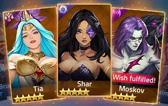
> - 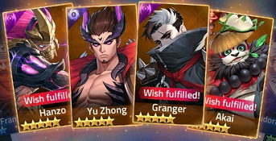

---

> ## **Mid Game** - Elements, Order, and Chaos
> 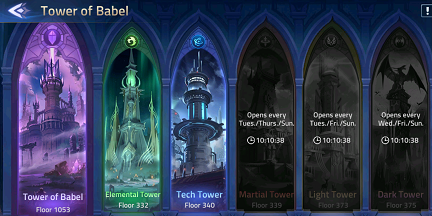
> 
> Once you reach a certain point, you will ***not*** be unable to make significant progress without having powerful teams in all of the five elements. This is where you need to focus on having a core of three heroes in ***each element***, for a total of ***15 Core Heroes***. Use the same strategy as in early game.
>
> In Addition to making Campaign progress, and Tower of Babel progress, it will now be essential to make progress in the ***elemental*** Tower of Babel climbs, because this is the **singular best source of resources in the game** to **level up your gear**, aside from daily quests like guild boss rushes.
>
> Even though you cannot use them in the elemental towers, **Order** and **Chaos** heroes will now be absolutely crucial to success. As you progress upwards in the elemental towers, you will receive periodic **Sacred Oath Scrolls**. These are the **best items in the game**, because they grant you access to **free Order and Chaos heroes**.
>
> 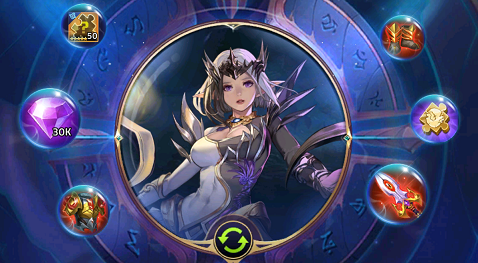
>
> **Lunox** should be the number one Order hero to focus your attention on, followed by **Yu Zhong** in Chaos. Lunox is a nearly-immortal healer who resonates with any element combination, while Yu-Zhong is a Chaos Tank/Fighter whose presense adds 30% defense to your party. Paired together with an **elemental core three**, they form a terrifyingly strong **five-hero party**.
>
> 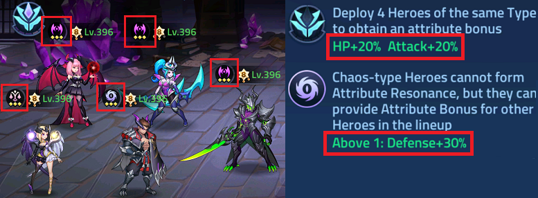

---

> ## **End Game** - Multi-Team Fights and Crippling Restrictions
> 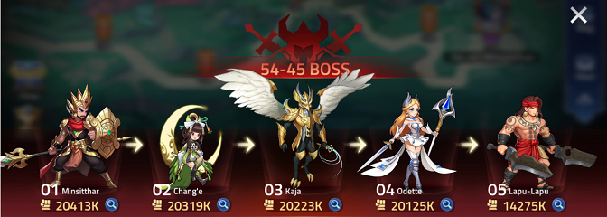
> 
> Mid game will now have prepared you to be able to assemble teams consisting of powerful heroes in every element as well as Order and Chaos. Advancing in both the ***Campaign Missions*** as well as the ***Arena*** will require fighting with up to ***Seven Teams*** (best 4 out of 7) essentially forcing you to create combination strategies for ***35 Heroes in a Single Confrontation***.
>
> If that were not enough, many variations of existing battles such as Nightmare Mode of Dungeons and other "hard mode" situations place restrictions that require you to either sacrifice heroes (temporarily) to proceed, or to win battles with a very specific set of restrictions. For example, certain battles may require you to use a certain number of heroes with a particular element, role, or weight of gear. Mid game should have prepared you with a versatile lineup of heroes to deal with this.
>
> You should also be aware that in the end game, ***All Your Heroes Are The Same Level***. There is a global mechanism in the ***Holy Sanctuary*** to level up ***all*** your heroes one level at a time. It requires very large amounts of ***Hero Experience***, ***Advance Essense***, and ***Battle Points***.
>
> 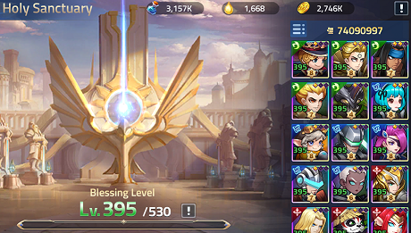

---

> # **Spending Resources Efficiently**
> ## Obtaining Order and Chaos Heroes
>
> ### Conventional wisdom says that the ***Premium 700% Giftpacks*** are the best way to spend real money in the game.
>
> ### ***Not always true!*** There are several types of Premium 700% packs and some of them are a ***total waste of money***.
>
> If you consider this first ***(bad!)*** pack, it contains a ***Level II Gear Refinement*** and 6 ***Random Gold Cards***. First of all, ***Never Spend Money on Gear Refinement Items***. You get those for free in so many places, including the normal idle chest. Paying for those is money down the toilet. Second of all, ***Never Spend Money on Random Gold Cards***. Random Gold Cards are usually Elite (not Epic) heroes and are thus mostly worthless. You'll get your wishlist golds from your normal daily quests, using gems to roll premium summons. Be patient and you'll get not only ***Wishlist Heroes***, but occasionally ***Order and Chaos Heroes***, from ***Premium Summons***, paid for from your ***Free Gems*** obtained from Daily Quests and other free sources.
>
> 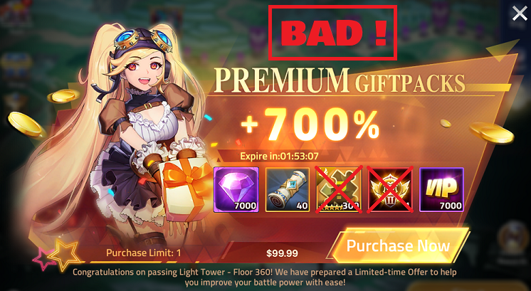
>
> ## Now, consider this ***(amazing!)*** premium gift pack.
>
> (It's only available when you level up your Holy Sanctuary by a multiple of 5)
>
> 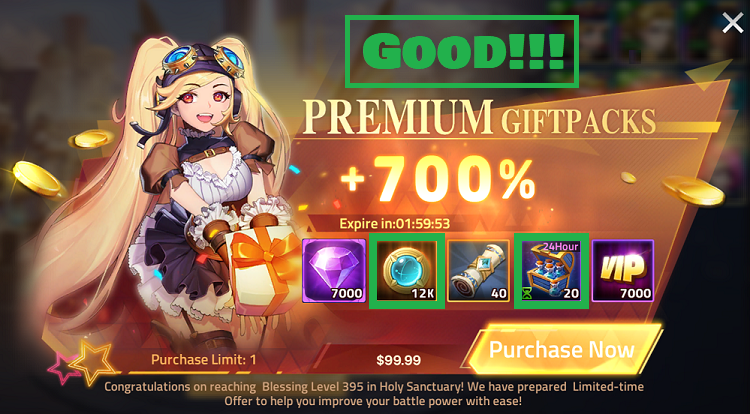
>
> ### Let's go through everything you get for your hard earned $99.99.
>
> - 7,000 Gems
> - 12,000 Sign of Stars
> - 40 Sacred Oath Scrolls
> - Giant Resource Pack
>
>The ***40 Sacred Oath Scrolls*** will probably grant you a gold card of the Order/Chaos hero you wished for. You can get a gold in 30-65 rolls of Sacred Oath, but I've found that usually it's right around 40, and if you miss it, just roll a couple more with gems. 500 gems per extra roll. But unlike Premium Summons, the "Junk" items or "Misses" are actually incredibly important resources. Leveling Resources, Gear, Soul Vessel Gems, other random Gold Card heroes... Every single Sacred Oath result is useful in some way.
>
> 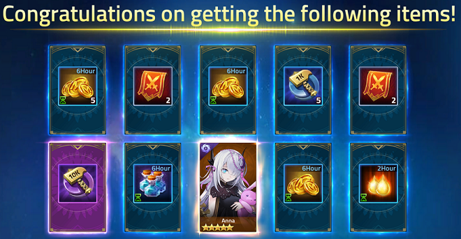
>
>The ***7,000 Gems*** can be used for Premium Summons, which result in Wish List Golds over time, Soul Vessel Gems at each milestone, and occasionally multiple golds with Chaos and Order heroes in the mix. Later on in the game, you can use the 7,000 gems to just roll more Sacred Oath summons at 500 gems per pop, in case you didn't get your Order/Chaos gold card with the 40 Sacred Scrolls.
>
>The 12,000 Sign of Stars are used to perform ***Lunomancy*** (Orlay) and are similar to Premium Summons in that they sometimes result in junk (bronze) cards, sometimes results in silver (good) cards, and at about the same rate as Premium Summons result in gold (Hero Exclusive) cards. Each hero can accumulate 9 of these cards to gain ***Extraordinary Skills in Battle***.
>
> 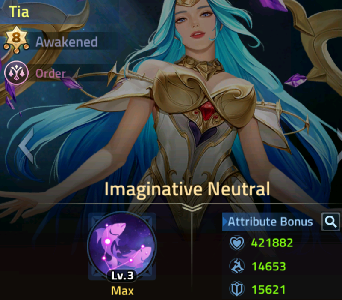
>
> 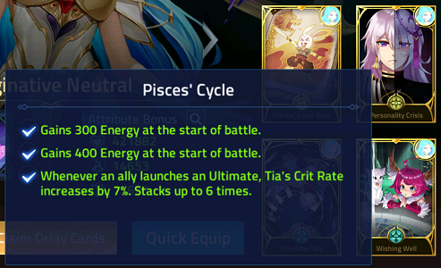
>
> ## So the verdict is that ***Premium 700%*** offers ***CAN BE*** some of the best.
> ## But ***not always***!
>
> ## Let's look at what is currently the ***Actual Best $99.99 Purchase*** in MLA.
>
> 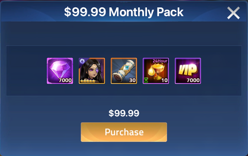
>
> ## This is a normal pack that you can only buy twice a month.
>
> I know what you're thinking. It doesn't look as good as the 700% Premium one, right?
>
> Let's do the math.
> 
> - 7,000 Diamonds. Check.
> - 30 Sacred Scrolls. We're short 10 from before.
>
> But now look at the last two items.
>
> First, we have a ***selectable*** mega pack. That means we don't have to take ***Experience*** or ***Battle Points***. Why does that matter? ***Advance Essence*** is ***BY FAR*** the hardest leveling resource to come buy. The fact that we can choose Advance Essense every time is ***insanely*** valuable for increasing your ***Sacred Sanctuary Level***. (And every time that levels up by a multiple of 5, you get the ***Best Premium 700% Offer*** in the game, providing purchasing power synergy!)
>
> The final item is simply the best. It's your choice of a gold Order or Chaos hero card. No guessing if the 40 Sacred Scrolls will yield your gold hero card. You just get it. When combining that gold Order/Chaos card with the other 44 Sacred Oath Summons you get (30 Scrolls and 14 from the Gems) this is basically a ***Guaranteed Level Six (1-Red-Star) Order Chaos Hero*** plus whatever else you get with the 44 summons.
> ## Verdict
> - You need 14 gold cards to awaken an Order or Chaos hero.
> - You need 16 more to max them out at Awakened Level 8.
> - That's 30 gold cards.
> - You can get 4 of them a month for $199.98 with this purchase alone.
> - Taking into account efficiency of both ***time*** and ***money***, this is the best offer.
> - Obviously, you can go faster by spending more, or slower by spending less.
>
> ## In Conclusion (Cheat Sheet!)
> ## Excellent Things For ***Light Spenders***:
> - Monthly Pass
> - Starlight Pass
> - Dungeon Pass
> - Fortuna Pass
> - Regular Pack Monthly Offers
> - Regular Packs with Tokens of Valor
> - Premium Packs (some of them)
>
> ## Most Important Things for ***Big Spenders***:
> - All Passes
> - All Premium Packs
> - All Regular Pack Special Offers (Daily/Weekly/Monthly)
> - All Regular Packs with Tokens of Valor. (Level those statues!)
> - Regular Packs of Gems combined with Sacred Scrolls as needed
>
> ## Things To ***NEVER Spend*** Money On:
> - Diamond Store
> - Limited Time Summons
> - Limited Time Event Packs
>   - Partake in events, just ***don't spend money*** on them
>   - Events are generally misleading with micro transactions
>   - In other words they nickel and dime you to death
>
> ## Get Those Valor Tokens Early!
>
> 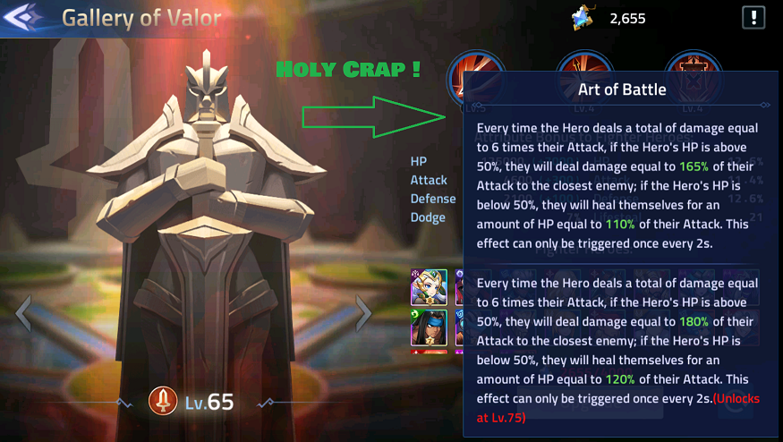
>

---

> # Other Topics Coming Soon
> - Fusion Guide
> - In-Depth Combat Guides
> - In-Depth Hero Specific Guides
> - Glory Road (Global Arena) Guide
> - Event Guides
